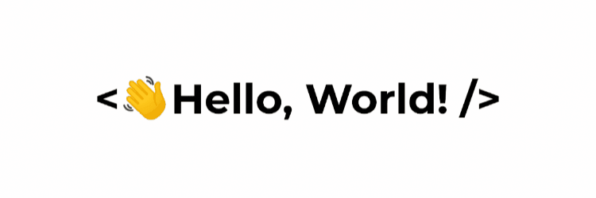

<h1 align="center">
  Hi There! 
  
  I'm Shaun Dsouza
</h1>

<!-- Typing SVG by DenverCoder1 - https://github.com/DenverCoder1/readme-typing-svg -->

 

  

## About Me

I’m Shaun Dsouza, a Computer Engineering student who enjoys turning ideas into real projects and constantly learning new technologies. My current focus is on Android development, JavaScript, Data Structures & Algorithms, and creative technologies like Three.js.

I love building clean and polished user experiences that feel practical, smooth, and meaningful. One of my main projects is [QuickPlan – Plan Smarter App for Android](https://play.google.com/store/apps/details?id=com.shaun.quickplan), a productivity app that is now officially available on the Play Store.

Lately, I’ve also started exploring game development alongside web and app development, as I enjoy experimenting with interactive experiences and creative ideas. Beyond coding, I’m deeply interested in open source, technology, creative arts like drawing and the process of continuously improving through projects and collaboration.

<h2 align='center'><strong>Socials</strong></h2>
 

 

  <h2><strong>Languages, Tools and Technologies</strong></h2>
   
  <table border="0">
    <tr>
      <td><strong>Programming Languages</strong></td>
      <td></td>
    </tr>
    <tr>
      <td><strong>Frontend Development</strong></td>
      <td></td>
    </tr>
    <tr>
      <td><strong>Backend Development</strong></td>
      <td></td>
    </tr>
    <tr>
      <td><strong>Database Technologies</strong></td>
      <td></td>
    </tr>
    <tr>
      <td><strong>Frameworks</strong></td>
      <td></td>
    </tr>
    <tr>
      <td><strong>Hosting Services</strong></td>
      <td></td>
    </tr>
    <tr>
      <td><strong>Developer Tools</strong></td>
      <td></td>
    </tr>
    <tr>
      <td><strong>Operating Systems</strong></td>
      <td>
         
        
      </td>
    </tr>
  </table>

<!-- Animated Flying Purple Bat -->

 
 

<!-- Animated Flying Purple Bat -->

<h3 align='center'><strong>Github Analytics</strong></h3>

 

 

<!-- Full-width Profile Details -->

  

  

  

